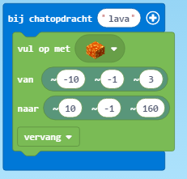
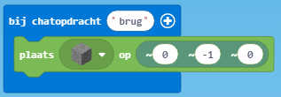
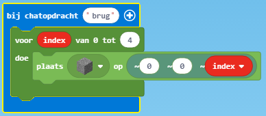
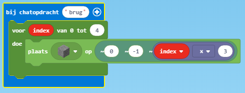
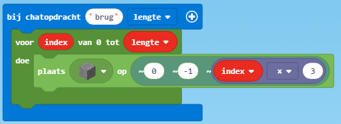
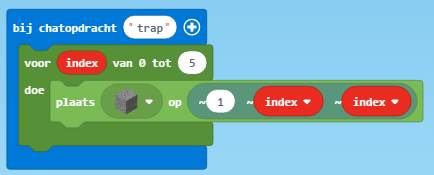
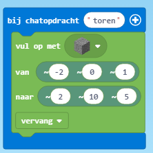

# Parkour

## De vloer is lava

## Bouw een brug
Stap 1: Plaats een blok onder je
   

Stap 2: Maak de brug langer

Hiermee voegen we een herhaling toe. Elke herhaling wordt er bij index 1 opgeteld. Hierdoor krijgt de brug een lengte van 4.

Stap 3: Maak gaten in de brug

Hierdoor komen en gaten van 2 blokken in de brug.

Stap 4: Maak de lengte variabel

Nu kunnen we in de chat de lengte van de brug zeggen. Bijvoorbeeld "brug 5".

## Bouw een trap

## Bouw een toren

