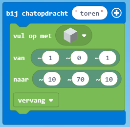

# Toren en trap

## Toren
De eerste stap is dat we een toren gaan bouwen. De code hiervoor komt er zo uit te zien:

1. We beginnen met het toevoegen van het blok 'bij chatopdracht'. Hier vullen we het commando "toren" in. Wanneer we in de chat "toren" zeggen wordt dit commando uitgevoerd.
   
2. Nu gaan we een blok 'vul op met' toevoegen. Deze zetten we in het blok 'bij chatopdracht'.

3. We kunnen kiezen welk soort blok we willen neerzetten door te klikken op het blok achter 'vul op met'. Kies hier welk blok je wil gebruiken.

4. Nu kunnen we gaan bepalen waar we de toren willen neerzetten. Zet achter 'van' de waarde '~1 ~0 ~1' en achter 'naar' de waarde '~10 ~70 ~10'.

> De waardes achter 'van' en 'naar' zijn coördinaten. De waarde achter 'van' betekend een positie links en een positie naar voren van de plek waar je staat (Het ligt er nog wel aan welke kant je op kijkt). De waarde achter 'naar' betekend dat de toren 10 blokken breed, 70 blokken hoog en 10 blokken lang wordt.  

5. Nu kunnen we de code testen door in minecraft "toren" te zeggen. Als alles goed is gegaan verschijnt er nu een toren vlak naast je.

## Trap

De tweede stap is dat we automatisch een trap laten bouwen. Dit laten we doen door de 'agent'. De code hiervoor komt er zo uit te zien:

1. We gaan als eerst weer een blok 'bij chatopdracht' toevoegen met hierin het commando "trap".

2. In het blok 'bij chatopdracht' zetten we nu het blok 'agent teleporteer naar'. Zet hierin de waarde '~1 ~0 ~0' en de richting 'Oost (positief X)'. Wanneer we dit uitvoeren komt de agent een blok voor ons te staan.

3. Nu gaan we de agent een blok geven zodat hij een trap kan bouwen. Dit kan met het blok 'agent zet blok of item'. Kies hierachter als blok een trap en daarna bij aantal '1' en in slot '1'.

4. Om het daadwerkelijk een trap te plaatsen voegen we een blok 'agent plaats' toe met als waarde erachter 'vooruit' zodat de agent de trap voor zich zet.

5. Nu willen we de agent laten bewegen zodat hij op een andere plek een trap neer kan zetten. Dit doen we door een blok 'agent beweeg' toe te voegen met de waarde 'vooruit' en met '1'. Hierdoor zet hij een stap naar voren.

6. We willen nu dat de agent 70 keer een trap neerzet omdat onze toren 10 blokken hoog is. Dit gaan we doen door een herhaling toe te voegen om de blokken 'agent plaats' en 'agent beweeg'. Kies het blok 'doe 4 keer herhalen' en veranderd de 4 in 70.

7. De agent kan nu een trap bouwen die 70 hoog is maar we moeten er nog voor zorgen dat hij de bocht omgaat op de hoek van de toren.  Dit gaan we doen door een 'als ... dan ... anders' blok toe te voegen. Deze zetten we in het 'doe 70 keer herhalen' blok.

8. Achter als zetten we het blok 'agent detecteer' blok neer met de waardes 'blok' en 'rechts'. Onder de 'als' zetten we de blokken 'agent plaats' en 'agent beweeg'. Zolang er nu een blok aan de rechterkant is bouwt de agent gewoon een trap voor zich uit.

9. Wanneer er geen blok aan de rechterkant is willen we dat de agent naar rechts draait en daarna een trap plaats en daarna een stap naar voren beweegt. Voeg onder 'anders' een blok 'agent draai' toe met de waarde 'rechts'. Voeg daarna de blokken 'agent plaats' en 'agent beweeg' toe net zoals onder de 'als'.

10. Nu kunnen we de agent een trap laten bouwen door in minecraft "trap" te zeggen in de chat.  