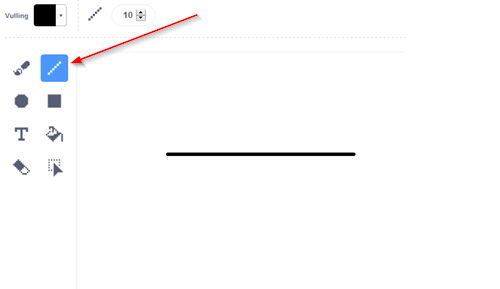
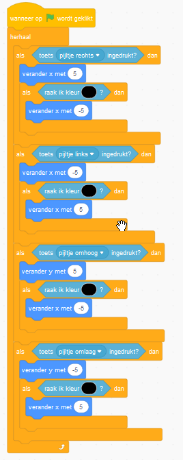
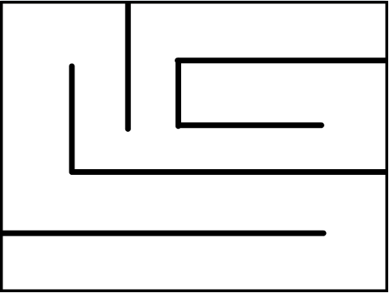
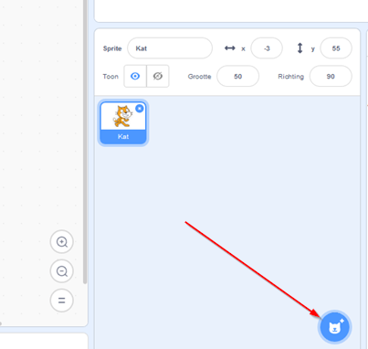
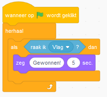
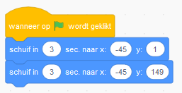
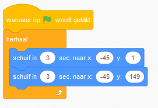

# Doolhof handleiding 

## Inhoud
- [Doolhof handleiding](#doolhof-handleiding)
  - [Inhoud](#inhoud)
  - [Basisspel](#basisspel)
  - [Uitbreidingen](#uitbreidingen)
    - [Monster vijand](#monster-vijand)

## Basisspel

Voeg de volgende gebeurtenis toe: 

 
Hiermee kun je code uitvoeren als het spel begint. Je kan bijvoorbeeld de kat laten bewegen. Voeg de volgende code toe aan de gebeurtenis om de kat te laten bewegen: 

 
Als je het spel start neemt de kat 10 stappen naar rechts. Nu willen we dat de kat blijft lopen als het spel begint. Dit kan door een herhaling toe te voegen:

 
Nu blijft de kat bewegen totdat de rand van het spel wordt geraakt. De volgende stap is dat we de kat willen kunnen besturen met de pijltjestoetsen. Om dit te doen willen we dat kat alleen beweegt als we op een toets drukken. Dit kan door een 'als' blok toe te voegen met daarin een blok die kijkt of er op een toets wordt gedrukt:   

Nu beweegt de kat alleen als pijltje naar rechts wordt ingedrukt. Nu willen we ervoor zorgen dat de kat ook de andere kanten op kan bewegen:

 
Nu is er voor elke richting een toets toegevoegd. Wanneer x veranderd gaat de kat naar links of naar rechts. En wanneer y veranderd gaat de kat naar boven of naar beneden. Door een minteken ('-') voor het getal te zetten zorg je ervoor dat de kat bijvoorbeeld naar links gaat in plaats van naar rechts. 

> Uitdaging: Zorg ervoor dat de kat sneller kan lopen.

We gaan de code van de kat aanpassen zodat wanneer de kat iets zwarts raakt hij niet beweegt. Hierdoor kan de kat niet door zwarte dingen heen. Eerst gaan we onze achtergrond aanpassen door hier een zwarte muur op te tekenen. Ga eerst naar 'speelveld': 

Ga daarna naar 'achtergronden': 

Nu kunnen we de achtergrond aanpassen door er bijvoorbeeld een zwarte lijn op te tekenen: 

Nu gaan we de code van de kat aanpassen zodat hij niet door de lijn kan. Voeg het volgende 'als' blok toe aan de code: 

Zorg dat de kleur in het blok 'raak ik kleur?' zwart wordt. Dit kan door helderheid op 0 te zetten door de schuifknop onder 'Helderheid' helemaal naar links te slepen. Als de kat nu naar rechts beweegt en de zwarte lijn raakt wordt hij weer naar links verplaatst zodat hij niet beweegt. Nu moeten we hetzelfde doen voor de andere richtingen. Pas de code op de volgende manier aan: 

Nu kan de kat niet meer door de zwarte lijnen. Je kan de achtergrond nu verder aanpassen door meer lijnen toe te voegen zodat je een doolhof krijgt. Bijvoorbeeld op de volgende manier:

> Uitdaging: Zorg ervoor dat de kat een geluid maakt als hij een muur raakt.

Als laatste stap gaan we een eindpunt toevoegen aan het doolhof. Wanneer je hier komt heb je het spel gewonnen. Dit gaan we doen door een nieuwe sprite toe te voegen. 

Kies voor een vlag en plaats deze aan het einde van het doolhof. Nu kunnen we code toevoegen zodat we het spel kunnen winnen. Als de kat de vlag raakt willen we dat hij zegt "gewonnen!". Voeg hiervoor de volgende code toe aan de kat:

> Uitdaging: Maak een knop waarmee het spel opnieuw begint.

De eerste versie van ons spel is nu af! Maar je kan het spel natuurlijk nog verder uitbreiden. Bijvoorbeeld met de onderstaande onderdelen. Maar je kan natuurlijk ook zelf iets verzinnen. 

- Monster vijand 
- Spook vijand 
- Deur en sleutel 
- .....

## Uitbreidingen

In de volgende hoofdstukken staat uitgelegd hoe je deze uitbreidingen zou kunnen maken.
 

### Monster vijand
 
Voeg als eerste een nieuwe sprite toe, bijvoorbeeld een monster. Het monster gaan we door het doolhof laten bewegen. Voeg eerst het volgede blok toe:

Om het monster te laten bewegen gaan we het volgende blok gebruiken:

Zet je monster op de plek waar je hem naartoe wil laten bewegen. Sleep nu een nieuw 'schuif'-blok naar de code van het monster en maak het vast een het blok met de vlag.

Zet nu je monster weer naar de beginplek en sleep een ander 'schuif'-blok naar de code van het monster een maak deze vast aan het vorige blok. Zet het aantal seconden op 3.

De code ziet er nu ongeveer zo uit:

Als het spel start beweeg het monster op en neer tussen twee punten. Hij doet dit nu een keer. Om hem de hele tijd te laten bewegen kunnen we de code in een herhaal blok zetten.

> Uitdaging: Laat het monster tussen 3 of meer punten bewegen.