# Ontwijk de hond handleiding 

## Inhoud
- [Ontwijk de hond handleiding](#ontwijk-de-hond-handleiding)
  - [Inhoud](#inhoud)
  - [Basisspel](#basisspel)
  - [Uitbreidingen](#uitbreidingen)
    - [Levens](#levens)
    - [Laat de kat sprinten](#laat-de-kat-sprinten)
    - [Muren toevoegen](#muren-toevoegen)
    - [Meer honden!](#meer-honden)
      - [Verbetering met eigen blok](#verbetering-met-eigen-blok)
  
## Basisspel

Voeg de volgende gebeurtenis toe: 

 
Hiermee kun je code uitvoeren als het spel begint. Je kan bijvoorbeeld de kat laten bewegen. Voeg de volgende code toe aan de gebeurtenis om de kat te laten bewegen: 

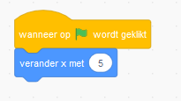
 
Als je het spel start neemt de kat 10 stappen naar rechts. Nu willen we dat de kat blijft lopen als het spel begint. Dit kan door een herhaling toe te voegen:

 
Nu blijft de kat bewegen totdat de rand van het spel wordt geraakt. De volgende stap is dat we de kat kunnen besturen met de pijltjestoetsen. Om dit te doen willen we dat kat alleen beweegt als we op een toets drukken. Dit kan door een 'als' blok toe te voegen met daarin een blok die kijkt of er op een toets wordt gedrukt:   

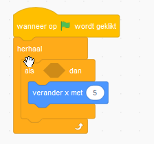
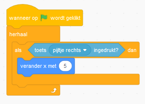

Nu beweegt de kat alleen als pijltje naar rechts wordt ingedrukt. 

> Uitdaging: Zorg ervoor dat de kat sneller beweegt

> Uitdaging: Laat de kat naar links bewegen in plaats van naar rechts

Nu willen we ervoor zorgen dat de kat ook de andere kanten op kan bewegen:

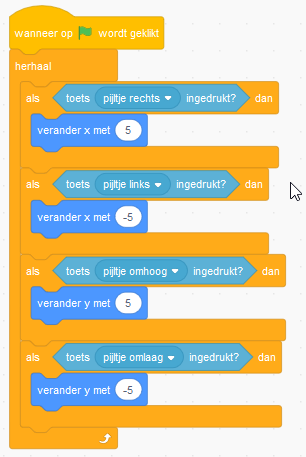
 
Nu is er voor elke richting een toets toegevoegd. Wanneer x veranderd gaat de kat naar links of naar rechts. En wanneer y veranderd gaat de kat naar boven of naar beneden. Door een minteken ('-') voor het getal te zetten zorg je ervoor dat de kat bijvoorbeeld naar links gaat in plaats van naar rechts. 

> Uitdaging: Geeft de kat een ander uiterlijk als hij omhoog beweegt. Dit kun je doen met het 'Verander uiterlijk naar' blok. 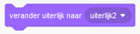

De volgende stap is dat we een hond toevoegen. Voeg hiervoor een nieuwe sprite toe: 

Nu gaan we code toevoegen om de hond te laten bewegen. Klik hiervoor op de hond bij sprites en voeg de volgende code toe: 

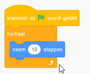

Nu beweegt de hond als het spel start. Nu gaan we ervoor zorgen dat als de hond de rand van het spel raak hij in de richting van de kat beweegt: 

Om ervoor te zorgen dat de hond naar een andere plek in het spel gaat als de kat geraakt wordt voegen we nog een 'als' blok toe. In dit blok wordt een willekeurig getal gekozen zodat de hond elke keer naar een ander plek gaat: 

> Uitdaging: Start een geluid als de hond de kat raakt.

De eerste versie van ons spel is nu af! Maar je kan het spel natuurlijk nog verder uitbreiden. Bijvoorbeeld met de onderstaande onderdelen. Maar je kan natuurlijk ook zelf iets verzinnen. 

- Levens 
- Laat de kat sprinten 
- Muren toevoegen 
- Meer honden!
- .....

## Uitbreidingen

In de volgende hoofdstukken staat uitgelegd hoe je deze uitbreidingen zou kunnen maken.

### Levens 

Ga naar Variabelen en kies voor 'Maak een variabele'. 

Noem de variabele 'levens'. 

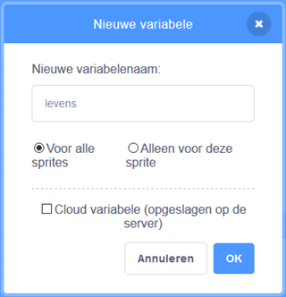

Een variabele is een blok die je een bepaalde waarde kan geven. Met dit blok gaan we het aantal levens van de kat bijhouden. Aan het begin van het spel willen we dat de kat 9 levens heeft. Dit kan op de volgende manier. 

Nu gaan we ervoor zorgen dat wanneer de kat geraakt wordt de levens minder worden. Bij de code voor de hond wordt al gekeken of de kat wordt geraakt. Hier gaan we nu een blok toevoegen dat ervoor zorgt dat het aantal levens minder wordt. 

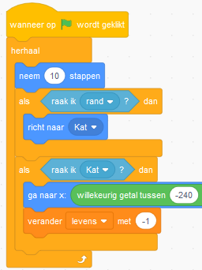

Wanneer de hond de kat raakt wordt er nu een leven afgehaald. We gaan er nu nog voor zorgen dat als het aantal levens '0' is het spel stopt. Dit kan door nog een 'als' blok toe te voegen. 

Door dit blok toe te voegen wordt er gekeken of het aantal levens nul is. Als dat zo is wordt alle code gestopt. 
 

### Laat de kat sprinten 

Ga naar Data en kies voor 'Maak een variabele'. 

Noem de variabele 'snelheid'

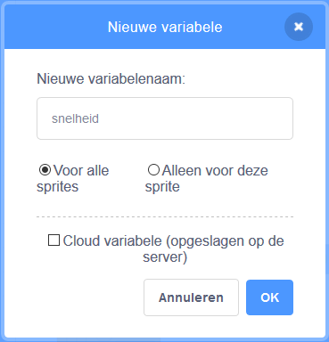

Een variabele is een blok die je een bepaalde waarde kan geven. Wij gaan de variabele de waarde '5' geven zodat de kat met die snelheid kan bewegen.  Dit kunnen we doen door het volgende blok toe te voegen. 

Nu gaan we het blok 'snelheid' gebruiken op de plek waar we bewegen. Verander je code op de volgende manier. 

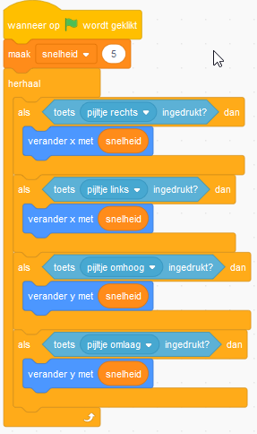

Nu moeten we er nog voor zorgen dat de kat de goede kant opgaat voor naar links en naar beneden. Voor deze getallen stond eerst een min teken('-'). Dit kunnen we op de volgende manier doen. 

Door de snelheid keer -1 te doen gaat de kat weer de goede kant op. We hebben nu de snelheid van de kat in een variabele gestopt. Nu kunnen we de snelheid van de kat aanpassen met code. We gaan er nu voor zorgen dat de kat sneller gaat wanneer je op spatie drukt. 

De kat heeft nu de snelheid '10' wanneer je op spatiebalk drukt. Nu gaan we er nog voor zorgen dat de snelheid weer terug wordt gezet naar de normale snelheid. Dit kan met de volgende code. 

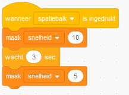

De snelheid wordt nu na 3 seconden weer normaal. 

> Uitdaging: Verander de code zodat de kat nadat hij sneller ging eerst 1 seconde langzamer gaat.

> Uitdaging: Zorg dat de hond langzamer gaat als de kat sneller gaat. 
 

### Muren toevoegen 

We gaan de code van de kat aanpassen zodat wanneer de kat iets zwarts raakt hij niet beweegt. Hierdoor kan de kat niet door zwarte dingen heen. Eerst gaan we onze achtergrond aanpassen door hier een zwarte muur op te tekenen. Ga eerst naar 'speelveld': 

Ga daarna naar 'achtergronden': 

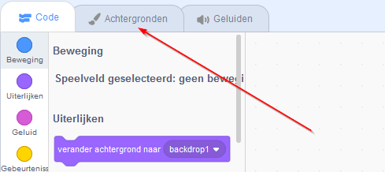

Nu kunnen we de achtergrond aanpassen door er bijvoorbeeld een zwarte lijn op te tekenen: 

Nu gaan we de code van de kat aanpassen zodat hij niet door de lijn kan. Voeg het volgende 'als' blok toe aan de code: 

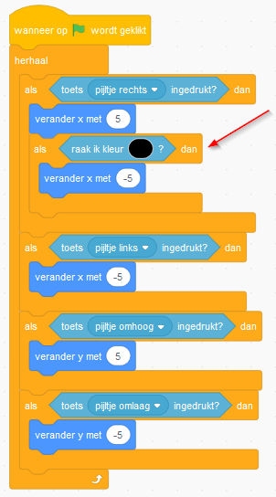

Zorg dat de kleur in het blok 'raak ik kleur?' zwart wordt. Dit kan door helderheid op 0 te zetten door de schuifknop onder 'Helderheid' helemaal naar links te slepen. Als de kat nu naar rechts beweegt en de zwarte lijn raakt wordt hij weer naar links verplaatst zodat hij niet beweegt. Nu moeten we hetzelfde doen voor de andere richtingen. Pas de code op de volgende manier aan: 

Nu kan de kat niet meer door de zwarte lijnen. Je kan de achtergrond nu eventueel verder aanpassen door meer lijnen toe te voegen.  
 

### Meer honden!

We gaan het spel aanpassen zodat de kat wordt achtervolgd door meerdere honden. Dit gaan we doen door een kloon toe te voegen van de hond.

Ga naar de code van de hond en voeg de volgende code toe:

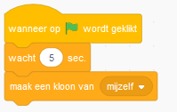

Deze code zorgt ervoor dat er na 5 seconden een kloon (een soort kopie) van de hond wordt gemaakt. De kloon van de hond beweegt nu nog niet. We moeten er nog voor zorgen dat er code gestart wordt als er een kloon wordt gemaakt. Dit kan met het volgende blok:

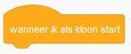

De volgende stap is dat de kloon op een willekeurige plek in het spel begint. Dit kan door het volgende blok toe te voegen:

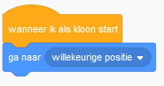

Nu kunnen we de kloon van de hond laten bewegen net als de normale hond. We kunnen hiervoor de herhaal kopiëren en toevoegen onder het blok 'Wanneer ik als kloon start'. De code ziet er dan zo uit:

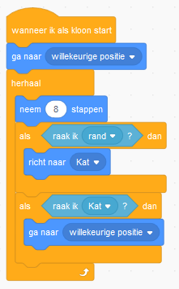

Nu renner er twee honden achter de kat aan!

> Uitdaging: Verander de code zodat er elke 5 seconden een nieuwe kloon wordt gemaakt.

> Uitdaging: Geef elke kloon een eigen uiterlijk, bijvoorbeeld met een kleur effect.

#### Verbetering met eigen blok

We kunnen de code voor de hond en de kloon nog wat beter maken. Nu heeft de code twee keer dezelfde herhaal code. Als we nu iets willen aanpassen aan de herhaal moeten we dat doen op twee plekken. Als we de hond bijvoorbeeld sneller willen laten bewegen moeten we dit op twee plekken aanpassen:

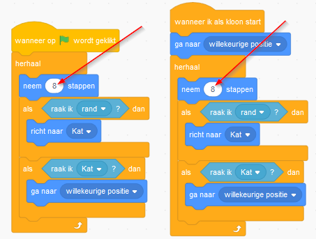

Dit kunnen we beter maken door een eigen blok toe te voegen. Dit kan op de volgende manier. Ga naar 'Mijn blokken' en klik op 'Maak een blok':

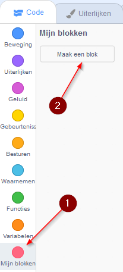

Geef het blok een naam, bijvoorbeeld 'Vang de kat':

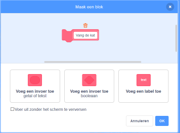

Er is nu een eigen blok toegevoegd waar we onze code aan toe kunnen voegen:

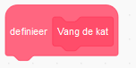

Aan dit blok gaan we de herhaal code toevoegen die er nu staat voor de hond en de kloon:

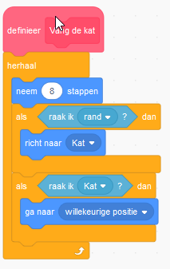

Ons eigen blok is nu af en nu kunnen we deze gebruiken in de code voor de hond. We gaan de andere herhaal blokken weghalen en deze vervangen voor het blok dat we net gemaakt hebben. Het nieuwe blok kun je vinden bij 'mijn blokken'. Wanneer je de code vervangen hebt ziet de code er op deze manier uit:

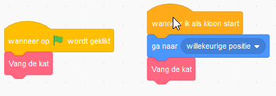