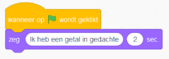
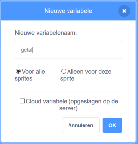
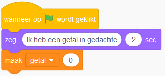
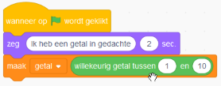
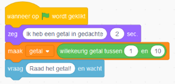
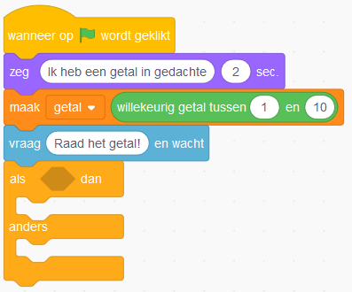
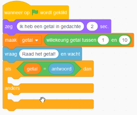
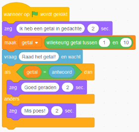
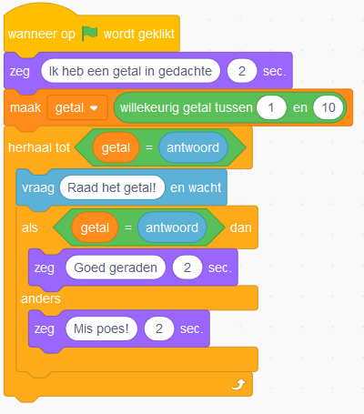

# Raad een getal handleiding

Voeg de volgende gebeurtenis toe: 

 
Hiermee kun je code uitvoeren als het spel begint. We kunnen de kat bijvoorbeeld iets laten zeggen. Dit kan door het volgende blok toe te voegen:

Als we het spel starten door op de groene vlag te klikken zegt de kat nu 'Ik heb een getal in gedachte'.

De volgende stap is dat we een willekeurig getal gaan bedenken zodat we dit later kunnen raden. Om dit te doen hebben we eerst een variabele nodig om het getal in op te slaan. Deze kunnen we op de volgende manier maken:

Noem de variabele 'getal'.

We gaan de variable nu een waarde geven door het volgende blok toe te voegen:

Het getal is nu altijd nul. Door het volgende blok aan te passen zorgen we ervoor dat het een willekeurig getal wordt tussen de 1 en de 10.

Nu gaan we er voor zorgen dat de kat ons een vraag stelt zodat we het getal kunnen raden. Dit kan op de volgende manier:

De kat stelt nu een vraag en het antwoord dat we geven wordt opgeslagen in de variable 'antwoord'.

De volgende stap is dat we gaan kijken of het antwoord gelijk is aan het getal. Hiervoor gaan we eerst een 'als - dan - anders' blok toevoegen.

Hiermee kunnen we eerst de twee getallen vergelijken. Als ze gelijk zijn wordt de code na de 'dan' uitgevoerd. Wanneer ze niet gelijk zijn wordt de code na de 'anders' uitgevoerd. Om de getallen te vergelijken voegen we de volgende code toe:

Als het getal goed wordt geraden willen we de kat 'Goed geraden' laten zeggen en als het fout is 'Mis poes!'. Dit kan op de volgende manier:

Nu willen we er nog voor zorgen dat je meerdere keren kan raden tot dat je het goede antwoord hebt gegeven. Dit gaan we doen door een herhaling toe te voegen. Dit kan op de volgende manier:

Goed gedaan! De eerste versie van ons spel is nu af.

> Uitdaging: Speel een geluid af als het getal goed wordt geraden

> Uitdaging: Maak het spel moeilijker door ervoor te zorgen dat de variabele getal hoger dan 10 kan worden.

> Uitdaging: Zorg ervoor dat je maximaal 5 keer kan raden. Tip: Maak een nieuwe variabele om het aantal pogingen bij te houden.

> Uitdaging: Als je het fout hebt zeg dan of het getal hoger of lager is. Tip: Gebruik het volgende blok om te kijken of een getal hoger is.