# Snake handleiding 

## Basisspel
We gaan eerst de kop van de slang toevoegen. Ga naar uiterlijken en kies voor 'Tekenen'.

Teken nu een hoofd met twee ogen erin.

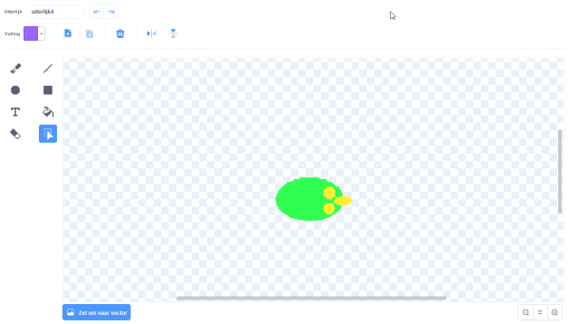

Nu gaan we er voor zogen dat de slang kan bewegen Voeg hiervoor de volgende gebeurtenis toe:

Dit blok zorgt ervoor dat er code wordt uitgevoerd als het spel start. Nu kunnen we hier het volgende blok aan vast maken:

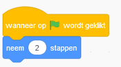

Als het spel start beweegt de slang nu 2 stappen. Om ervoor te zorgen dat de slang blijft bewegen gaan we een herhaal toevoegen:

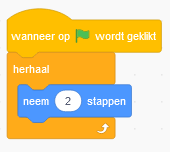

Nu blijft de slang bewegen tot hij bij de rand is. De volgende stap is dat we ervoor gaan zorgen dat we de slang kunnen besturen. Eerst gaan we de slang omhoog laten bewegen als we op 'pijltje omhoog' drukken. Voeg hiervoor de volgende gebeurtenis toe:

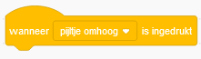

Dit blok voert code uit als er op een toets wordt gedrukt. Om de slang omhoog te laten bewegen maken we hier het volgende blok aan vast:

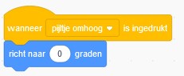

Nu moeten we er nog voor zorgen dat de slang ook de andere kanten op kan bewegen. Voeg hiervoor de volgende code toe:

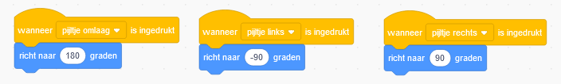

Nu kunnen we alle kanten op bewegen! De volgende stap is het lichaam van de slang steeds langer te laten worden. Dit gaan we doen door een lijn te tekenen. Hiervoor moeten we eerst de 'pen' uitbreiding toevoegen aan Scratch:

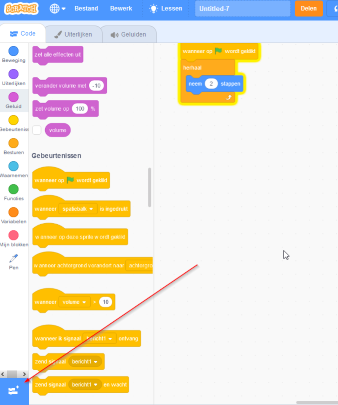

Met deze uitbreiding krijgt de sprite een pen waarmee hij lijnen kan tekenen als hij beweegt. Om de pen aan te zetten kunnen we het volgende blok toevoegen:

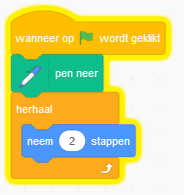

Om het lijf van de slang dikker te maken kunnen we de pendikte aanpassen met de volgende code:

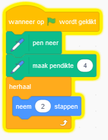

Ook willen we dat het lijf dezelfde kleur krijgt als de kop. Dit kan met het volgende blok:

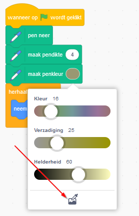

Om precies dezelfde kleur te kiezen als de slang kun je op het onderste icoontje klikken en daarna op de kop van de slang in het spel klikken.

Het is handig dat elke keer dat het spel start de lijf van de slang weer verdwijnt en de slang in het midden van het spel begint. Dit kunnen we doen met de volgende code:

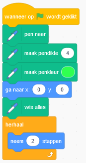

Nu kunnen we het spel leuker gaan maken door ervoor te gaan zorgen de we punten kunnen verdienen. Dit gaan we doen door de slang appels te laten eten. Voor elke appel krijg je een punt. Hiervoor gaan we een nieuwe sprite toevoegen:

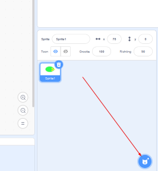

Eerst gaan we ervoor zorgen dat de appel op een willekeurige plek in het spel verschijnt met de volgende code:

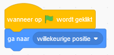

Ook willen we dat de appel wat kleiner wordt:

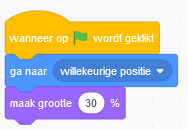

Nu gaan we elke keer dat de slang beweegt kijken of hij de appel raakt:

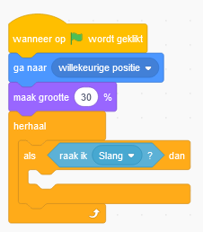

Nu moeten we gaan zorgen dat we een score kunnen gaan bijhouden. Dit kunnen we gaan doen moet een variable. Een variable kun je een waarde geven, bijvoorbeeld een getal, die je met code kan veranderen. Voeg een variable 'score' toe:

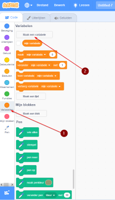

Nu kunnen we zorgen dat we een punt krijgen als de slang de appel raak met de volgende code:

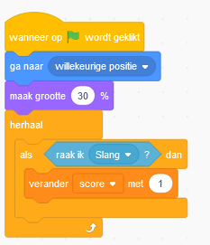

Nu krijgen we elke keer dat de slang de appel raak er een punt bij. Om ervoor te zorgen dat de score niet heel snel optelt gaan we de appel verplaatsen als we een punt scoren door de volgende code toe te voegen:

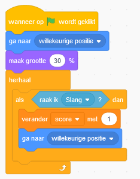

Nu gaan we het spel nog wat moeilijker maken door ervoor te zorgen dat de slang niet mag botsen met de rand of met zichzelf. Eerst gaan we kijken of de slang de rand raakt met de volgende code:

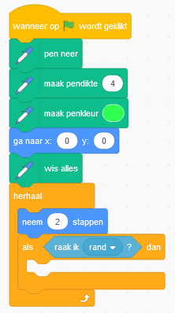

Elke keer als de slang beweegt kijken we of de rand wordt geraakt. Als dit zo is gaan we er nu voor zorgen dat het spel stopt en de slang zegt dat het spel is afgelopen:

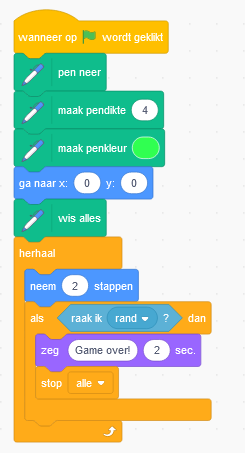

Nu gaan we nog kijken of de slang zichzelf raakt. Dit gaan we doen door eerst een 'of' blok toe te voegen. Hiermee kijken we of we de rand raken of het lijf van de slang:

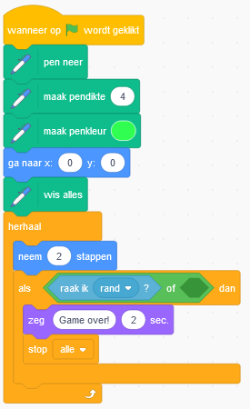

Om te kijken of de slang zichzelf raak kijken we of de ogen het lichaam van de slang raakt door te kijken naar de kleuren:

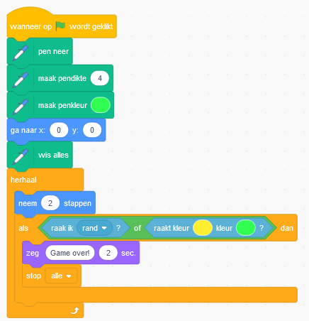

Maak de eerste kleur gelijk aan de kleur van de ogen en de andere kleur gelijk aan de kleur van het lijf. Doe dit in deze volgorde anders werkt het niet! De eerste versie van ons spel is nu af! Maar je kan het spel natuurlijk nog verder uitbreiden.